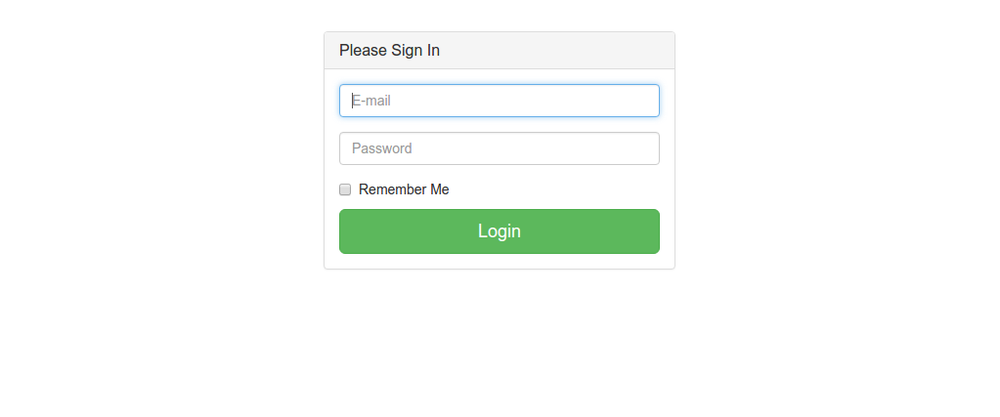
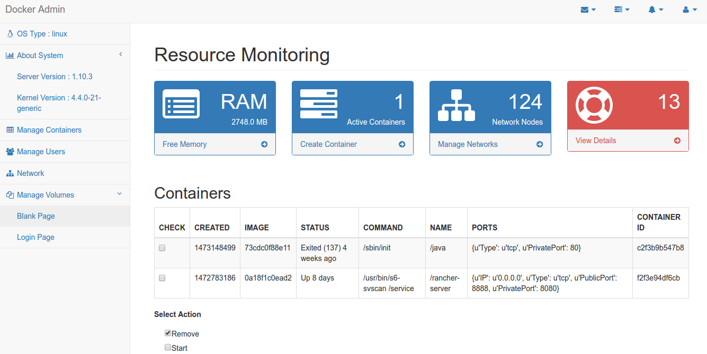
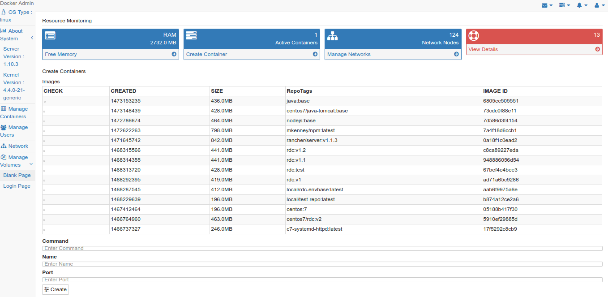
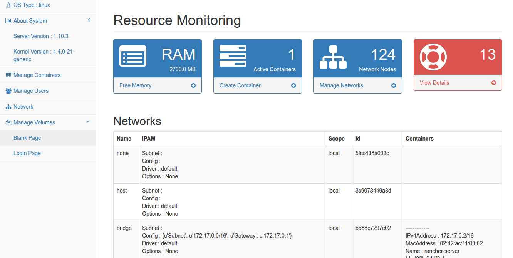

# DockerDashboard
## **Step**

1.  Install following prerequsit to run this app

	* Install docker url:

		[https://docs.docker.com/engine/installation/linux/ubuntulinux/](https://docs.docker.com/engine/installation/linux/ubuntulinux/) 
        
 	```Bash
	$ pip install docker-py
	$ sudo pip install Flask
	```
    * download the zip:
    
    	[https://github.com/jasonhubs/DockerDashboard/archive/master.zip](https://github.com/jasonhubs/DockerDashboard/archive/master.zip)

2. if you are using this dashboard remotely change the ip in DockerDashboard/master/view.py in below line

	```python
	app.run([ip],8080,debug=True)
	```
    
	and use url : [http://[ip]:8080/login](http://[ip]:8080/login)

	otherwise if you are running this code locally don’t change DockerDashboard/master/view.py file

    and access url is : [http://localhost:8080/login](http://localhost:8080/login)

3. To run Server  :+1:

		python run.py
Login :
Id : admin@gmail.com
Pass: admin

4. **Screenshot**

	- **login**

	- **manage**

	- **create**

	- **network**

